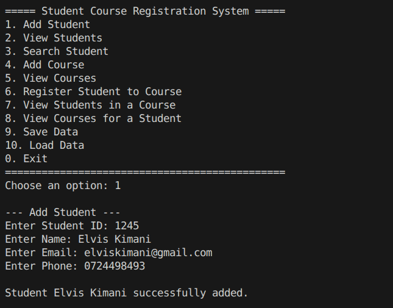
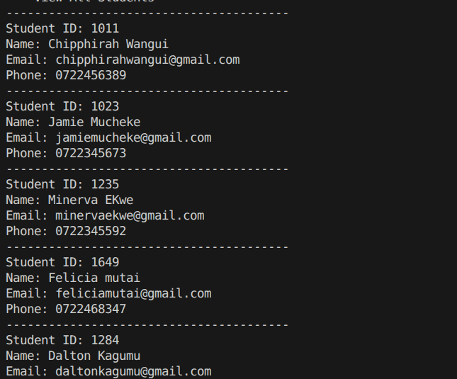
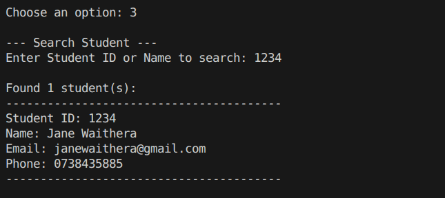
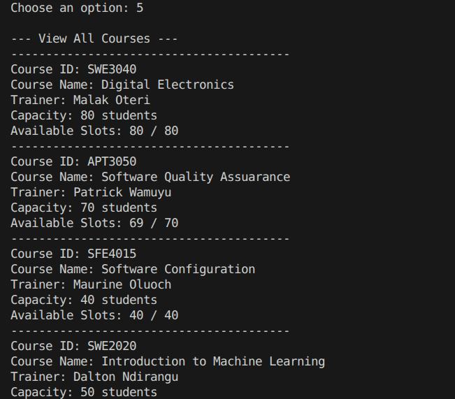
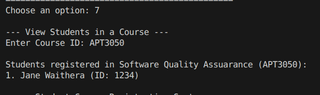
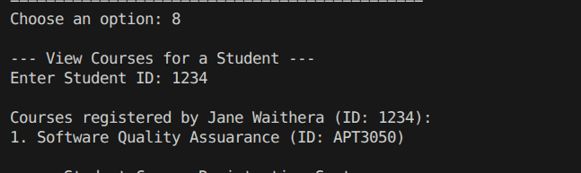

1. What was the hardest part of this project?
The part that i struggled with most was fetching files from the .txt files which were populated with entries like SWE3040|Digital Electronics instead of student-to-course links and running it after validation without errors.

2. Which classes did you create and why?
Person (models/person.py). I created it for the inheritance that serves as a class containing shared properties like name, email, and phone_number.
Student (models/student.py). It was suppopsed to inherit from Person and adds student_id and custom string representations.
Course (models/course.py). It encapsulates course details (ID, name, trainer, capacity).
SchoolSystem (services/school_system.py). IT acts as the primary logical controller. It encapsulates state lists, validations, and disk operations to separate core logic from the console menu (main.py).
3. How does your registration logic prevent duplicate registrations?
Before saving a registration, the system loops through self.registrations and compares the target student_id and course_id (case-insensitively)
If a match is found, a ValueError is raised, stopping duplicate registration.

4. How does your system check if a course is full?
When registering a student, the system counts how many students are currently enrolled in that course and compares it against the course's maximum capacity:

5. What bugs did you face and how did you fix them?
ID Case Mismatches: Entering student IDs like s001 vs S001 led to lookup failures. Fix: Applied .strip().upper() to all ID comparisons.
Bad Data File Formatting: Empty lines or malformed lines in the .txt database caused index crashes during startup. Fix: Wrapped file reads in try/except and checked len(parts) == 4 before splitting.

6. Which part of the code would you improve if you had more time?
Input Validation: Use regular expressions to validate that email structures are correct (e.g. checking domain endings) and phone numbers match local formats.
Database Integration: Switch from raw .txt files to a SQLite database to support queries and relations more cleanly.
7:40 AM

